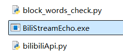
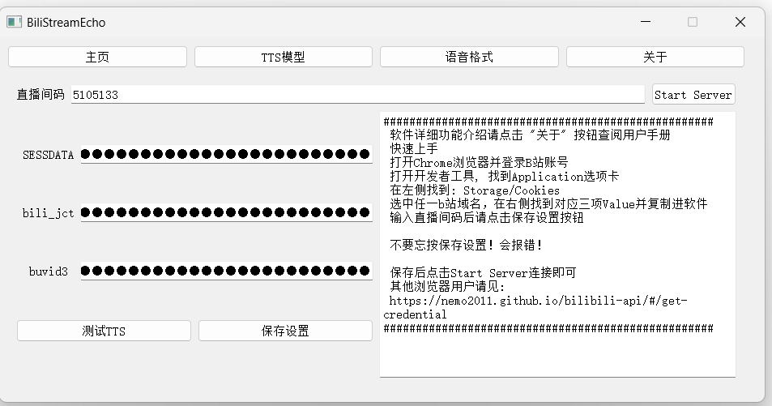
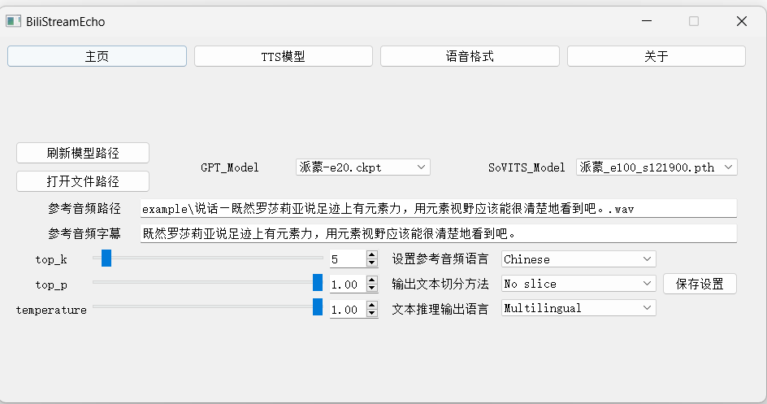
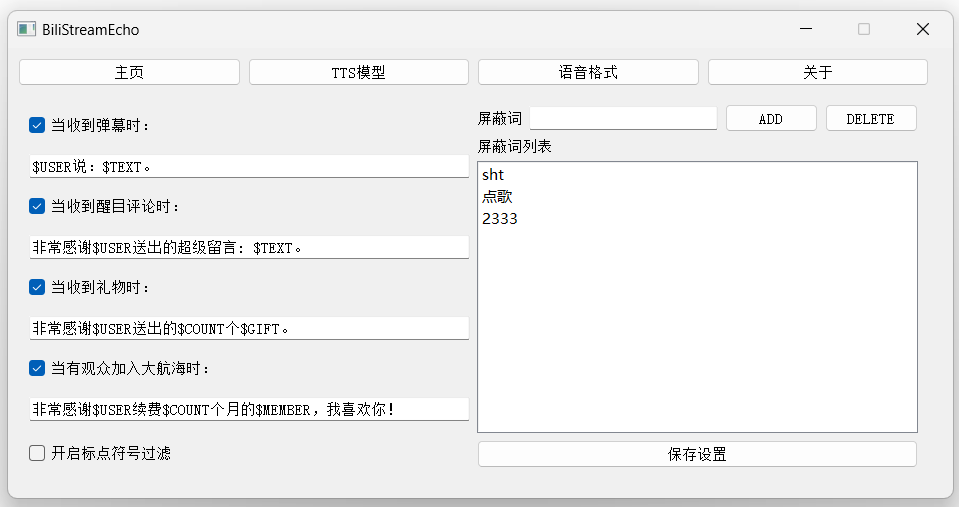

<div align="center">

# BiliStreamEcho

基于GPT-SoVITS的B站用自定义AI弹幕转语音软件<br><br>


[**English**](../../README.md) | **中文简体**
</div>

---

## 安装

BiliStreamEcho 1.0 整合包
- OneDrive:
- 度盘:

### Windows

如果你是 Windows 用户（已在 win>=10 上测试），可以直接下载整合包

### Linux

待测试

### macOS

待测试

### 手动安装

#### 安装依赖

```bash
pip install -r requirements.txt
```

#### 安装 FFmpeg

##### Conda 用户

```bash
conda install ffmpeg
```

##### Ubuntu/Debian 用户

```bash
sudo apt install ffmpeg
sudo apt install libsox-dev
conda install -c conda-forge 'ffmpeg<7'
```

##### Windows 用户

下载并将 [ffmpeg.exe](https://huggingface.co/lj1995/VoiceConversionWebUI/blob/main/ffmpeg.exe) 和 [ffprobe.exe](https://huggingface.co/lj1995/VoiceConversionWebUI/blob/main/ffprobe.exe) 放置在 GPT-SoVITS 根目录下。

## 参数说明

### Home 页
- **ID code**：直播房间号直接复制
- **SESSDATA, bili_jct 和 buvid3** 从网页获取，相关教程：https://nemo2011.github.io/bilibili-api/#/get-credential

### Model 页

#### 模型设置参数
- **File Path**：打开文件路径
- **GPT_Model 和 SoVITS_Model**：分别读取 GPT_weights 和 SoVITS_weights 文件夹中的模型文件
- **Reference Audio**：参考音频文件路径
- **Audio Subtitle**：参考音频的字幕
- **Reference_Language**：参考音频的语言

#### 推理参数
- **Cutting_Method**：切分方法
- **Output_Language**：输出语言

### Comment 页

#### 输出文本格式相关变量
- **$USER**：用户名
- **$TEXT**：评论内容
- **$COUNT**：数量，与礼物数量以及加入会员时间有关
- **$GIFT**：礼物名
- **$MEMBER**：会员类型

#### 其他参数
- **标点符号清除**：勾选后程序会清除推理文本的标点，对推理速度有一定影响。如果有标点推理速度不理想或者经常报错可以勾选。
- **Block Words 筛选**：在选框中输入词汇后点击 ADD 加入屏蔽词库。在下方列表中选中后点击 DELETE 可删除屏蔽词。

### 关于 top_p, top_k 和 temperature
- 没经验的话保持默认即可。这些参数控制随机性，值越大随机性越大，建议默认。
- **top_k** 挑出前几个概率最大的 token。
- **top_p** 在 top_k 基础上筛选 token。
- **temperature** 控制随机性输出。

**来自GPT-SoVITS文档的举例：**
- 有100个 token，top_k 设为5，top_p 设为0.6，temperature 设为0.5。
- 从100个 token 中挑出5个概率最大的 token，这五个 token 的概率分别是（0.3，0.3，0.2，0.2，0.1）。
- 再挑出累加概率不超过0.6的 token（0.3和0.3），再从这两个 token 中随机挑出一个 token 输出，其中前一个 token 被挑选到的几率更大。

还不理解？参数拉满随机性更大，拉低则重复性更高。

## 操作步骤
### 启动



1. 下载整合包，解压后将项目文件放在无中文名的路径上
2. 以**管理员身份**点击 **BiliStreamEcho.exe**启动程序
3. 初次启动较慢是正常现象，如果等待很久依然没有动静可以关闭后点击go-mainpage.bat进入调试模式
4. 如果报错了跟我说
### 连接


 1. 打开Chrome浏览器并登录B站账号 （其他浏览器用户请见:https://nemo2011.github.io/bilibili-api/#/get-credential ） 
 2. 打开开发者工具, 找到Application选项卡
 3. 在左侧找到: Storage/Cookies
 4. 选中任一b站域名，在右侧找到对应三项Value并复制进软件
 5. 输入直播间码后请点击**保存设置**按钮 
6. 保存后点击Start Server连接即可

**请不要将你的相关Value透露给他人，有盗号风险**

**保存后的Value存于本地parameters.json中，在与他人分享前请删除相关参数**
 
**不要忘按保存设置！会报错！**


### TTS模型设置


1. 点击**TTS模型**按钮，点击**打开文件路径**打开项目目录
2. 在文件夹（GPT_weights、SoVITS_weights、example）中放入语音模型以及参考音频。 
3. 点击**刷新模型路径**按钮或重启软件
4. 选择对应模型以及参考音频文件路径。 （建议使用数据集中的音频，最好为5秒。参考音频很重要！会学习语速和语气，请认真选择。） 
5. 输入参考音频的文本和对应的语种。
4. 选择要合成文本的参数，注意语种要对应。一般推荐选择中英混合，不过遇到日文名的观众可能会读不出名字。对电脑性能有信心的可以选择多语种。
5. 切分建议选择50字一切，低于50字的不切。如果50字一切报错，则显存太小，可以按句号切分。如果不切，显存越大能合成的越多，但合成过长容易胡言乱语。实测4090显卡大约能合成1000字，但即使是4090也建议切分生成。
6. **点击保存设置 很重要！不要忘记！**

### 语音格式设置


1. 点击 **语音格式**按钮，进入页面
2. 我感觉这一页没什么好说的，总之勾选可以开启/关闭对应项目，可以自定义添加/删除屏蔽词以及更改输出格式
3. 对应参数说明见上文，参数理论上可以删除，也就是说本来是$USER说: $TEXT.你可以删除$USER只保留$TEXT，这样TTS输出时就不会念观众名只读弹幕内容了。
3. 设置参数后点击**保存设置**按钮


## 参考文档
- **GPT-SoVITS**：https://github.com/RVC-Boss/GPT-SoVITS
- **bilibili-api**：https://github.com/Nemo2011/bilibili-api
- **部分公开语音模型链接**
- ***整合包自带派蒙模型与otto模型***
- 米家：https://www.yuque.com/baicaigongchang1145haoyuangong/ib3g1e/nwnaga50cazb2v93
- Mygo：https://www.bilibili.com/video/BV1XH4y137Lk/?spm_id_from=333.337.search-card.all.click&vd_source=4e6fd11ccbcccf162770ae5618e3c76f
- GBC：https://www.bilibili.com/video/BV1gU411o7Ec/?spm_id_from=333.337.search-card.all.click&vd_source=4e6fd11ccbcccf162770ae5618e3c76f
- 冬雪莲：https://www.bilibili.com/video/BV1aQ4y1w7bF/?spm_id_from=333.337.search-card.all.click&vd_source=4e6fd11ccbcccf162770ae5618e3c76f